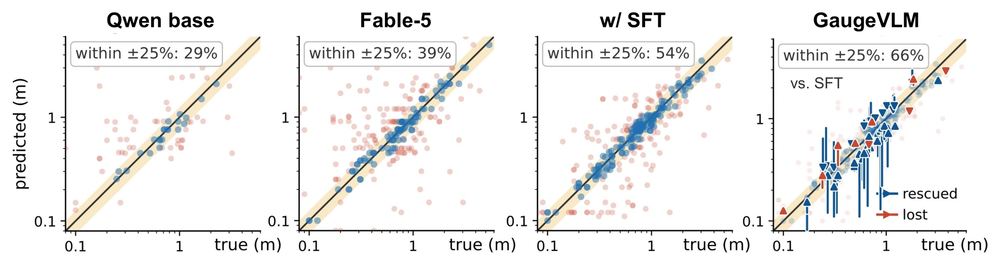

<div align="center">

<picture>
  <source media="(prefers-color-scheme: dark)" srcset=".github/assets/readme-header-dark.svg">
  
</picture>

### Structuring Spatial Supervision<br>with Measured Geometric Interventions

<br>

**Hongbo Wang · Zihan Lin · Wenkui Yang · Yuang Ai**<br>
**Shiran Ge · Jie Cao · Huaibo Huang · Ran He**

Institute of Automation, Chinese Academy of Sciences · UCAS<br>
The Chinese University of Hong Kong

<a href="https://wafer-bob.github.io/GaugeVLM/"></a>
&nbsp;
<a href="https://wafer-bob.github.io/GaugeVLM/assets/GaugeVLM.pdf"></a>

<br><br>

**Measured errors. Shared truths. Better spatial reasoning.**

[Highlights](#highlights) · [Results](#results) · [Data & evaluation](#data--evaluation) · [Citation](#citation)

</div>

GaugeVLM teaches vision-language models to **measure spatial errors**, **stay correct across camera views**, and **respond to geometric changes**. It makes spatial supervision explicit through controlled object and camera interventions in 3D scenes.

<p align="center">
  <a href="https://wafer-bob.github.io/GaugeVLM/">
    
  </a>
</p>

<p align="center"><a href="https://wafer-bob.github.io/GaugeVLM/#playground"><strong>Explore the interactive demo →</strong></a></p>

## Highlights

<p align="center">
  
</p>

- 📐 **Measured geometric errors.** GaugeDPO converts distance and clock-direction errors into preference margins, so larger spatial mistakes require stronger separation.
- 👁️ **Correct across views.** Direct supervision ranks the true canonical relation above incorrect candidates across camera views, including the hardest view.
- 🔄 **Learning from interventions.** Controlled object movements reveal how relations change. GaugeDPO links these changes to answer-odds contrasts while allowing confidence to vary across views.
- 🌐 **Consistent gains across backbones.** All **10 established spatial metrics** improve over GaugeSFT on **Qwen2.5-VL-7B, GLM-4.1V-9B, and Pixtral-12B**.

## Results


### Spatial understanding

**Qwen2.5-VL-7B.** GaugeVLM improves MSMU distance from **47.5 → 62.5** and QSpatial+ from **45.5 → 64.4**. All scores below are percentages (↑); gains are percentage points over GaugeSFT.

| Benchmark / metric | GaugeSFT | GaugeVLM | Gain |
| :--- | ---: | ---: | ---: |
| MSMU · Distance | 47.5 | **62.5** | **+15.0** |
| MSMU · Width | 48.3 | **55.1** | **+6.8** |
| MSMU · Height | 67.0 | **71.4** | **+4.4** |
| QSpatial+ · δ₂ | 45.5 | **64.4** | **+18.9** |
| SURDS · Distance | 22.4 | **30.4** | **+8.0** |
| SURDS · Depth | 24.3 | **35.7** | **+11.4** |
| SpatialRGPT · Quantitative | 33.5 | **43.1** | **+9.6** |
| SpatialRGPT · Qualitative | 74.7 | **81.6** | **+6.9** |
| 3DSRBench · Accuracy | 48.2 | **56.9** | **+8.7** |
| BLINK · Accuracy | 50.5 | **56.7** | **+6.2** |

<details>
<summary><strong>Results on GLM-4.1V-9B and Pixtral-12B</strong></summary>

**GLM-4.1V-9B**

| Benchmark / metric | GaugeSFT | GaugeVLM | Gain |
| :--- | ---: | ---: | ---: |
| MSMU · Distance | 67.5 | **72.5** | **+5.0** |
| MSMU · Width | 57.3 | **65.2** | **+7.9** |
| MSMU · Height | 67.0 | **75.8** | **+8.8** |
| QSpatial+ · δ₂ | 49.5 | **58.4** | **+8.9** |
| SURDS · Distance | 33.9 | **35.2** | **+1.3** |
| SURDS · Depth | 29.1 | **31.3** | **+2.2** |
| SpatialRGPT · Quantitative | 38.4 | **43.5** | **+5.1** |
| SpatialRGPT · Qualitative | 68.8 | **78.7** | **+9.9** |
| 3DSRBench · Accuracy | 46.7 | **50.8** | **+4.1** |
| BLINK · Accuracy | 56.2 | **58.2** | **+2.0** |

**Pixtral-12B**

| Benchmark / metric | GaugeSFT | GaugeVLM | Gain |
| :--- | ---: | ---: | ---: |
| MSMU · Distance | 50.0 | **52.5** | **+2.5** |
| MSMU · Width | 53.9 | **56.2** | **+2.3** |
| MSMU · Height | 69.2 | **75.8** | **+6.6** |
| QSpatial+ · δ₂ | 7.9 | **11.9** | **+4.0** |
| SURDS · Distance | 22.0 | **28.5** | **+6.5** |
| SURDS · Depth | 18.8 | **23.7** | **+4.9** |
| SpatialRGPT · Quantitative | 18.0 | **28.0** | **+10.0** |
| SpatialRGPT · Qualitative | 60.0 | **67.0** | **+7.0** |
| 3DSRBench · Accuracy | 43.5 | **48.0** | **+4.5** |
| BLINK · Accuracy | 37.0 | **42.6** | **+5.6** |

</details>

<sub>Source: spatial understanding results in the paper. Gains are computed from the displayed, rounded scores. The 10 metrics above exclude Constancy-Bench probes.</sub>

[Explore the interactive results](https://wafer-bob.github.io/GaugeVLM/#results) · [Download the result data](assets/results.csv)

### More accurate spatial measurements

<p align="center">
  
</p>

Among plotted numerical predictions across MSMU metric tasks, **66% fall within ±25% relative error**, versus **54% after SFT**. Missing or unparseable outputs are excluded; this diagnostic differs from the main benchmark accuracy metric.

### Consistency and data efficiency

- **Correct across camera views:** group accuracy rises from **50.0% to 69.5%**, while wrong agreement falls from **20.0% to 11.5%**, compared with SFT initialization in the cross-view audit.
- **Efficient preference learning:** GaugeDPO with **25% of the preference pair-draw budget** surpasses full-budget DPO on all five evaluated data-efficiency metrics (7,500 draws from the 30,000-pair pool).

## Data & evaluation

**Gauge-50K** contains **50,436 spatial preference pairs** across metric distance, clock direction, vertical relation, graded errors, and cross-view supervision. **30,000 pairs** form the preference-training pool.

**Constancy-Bench** evaluates distance ranking, photometric consistency at a fixed camera, and correct responses to object relocation.

[View the dataset and evaluation overview →](https://wafer-bob.github.io/GaugeVLM/#data)

## Citation

If you find GaugeVLM useful for your research, please consider citing our work.

<details>
<summary>BibTeX</summary>

```bibtex
@misc{wang2026gaugevlm,
  title   = {GaugeVLM: Structuring Spatial Supervision
             with Measured Geometric Interventions},
  author  = {Hongbo Wang and Zihan Lin and Wenkui Yang
             and Yuang Ai and Shiran Ge and Jie Cao
             and Huaibo Huang and Ran He},
  year    = {2026},
  url     = {https://github.com/wafer-bob/GaugeVLM},
  note    = {Preprint}
}
```

</details>
