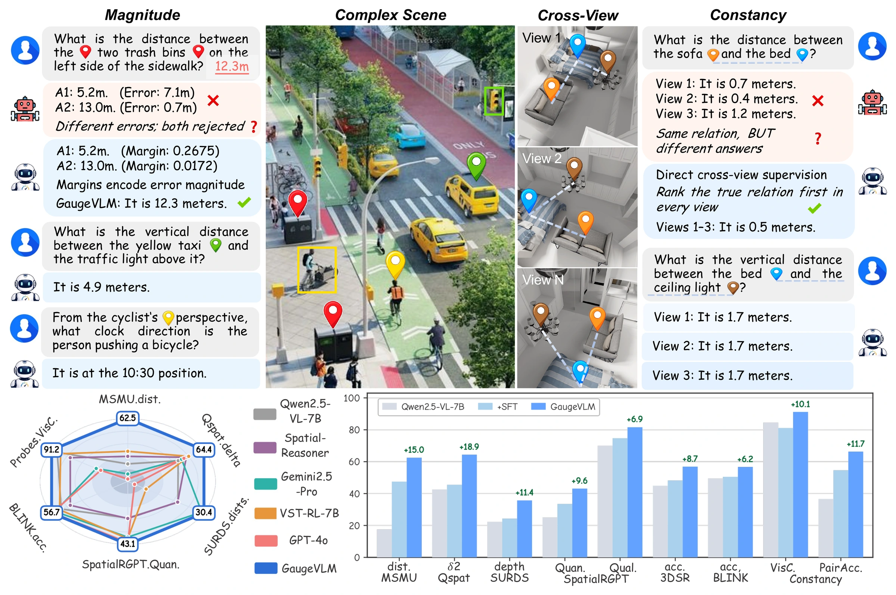
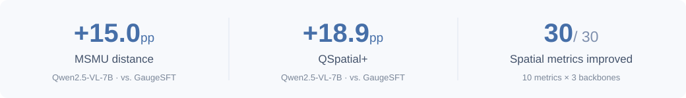
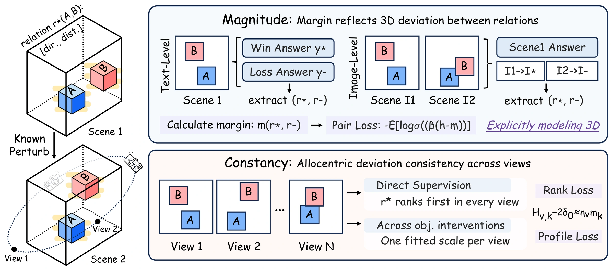

<div align="center">


<br>

**Hongbo Wang · Zihan Lin · Wenkui Yang · Yuang Ai**<br>
**Shiran Ge · Jie Cao · Huaibo Huang · Ran He**

Institute of Automation, Chinese Academy of Sciences · UCAS<br>
The Chinese University of Hong Kong

<a href="https://wafer-bob.github.io/GaugeVLM/"></a>
&nbsp;
<a href="https://wafer-bob.github.io/GaugeVLM/assets/GaugeVLM.pdf"></a>
&nbsp;


<br><br>

**Measured errors. Shared truths. Better spatial reasoning.**

</div>

GaugeVLM teaches vision-language models to **measure spatial errors**, **stay correct across camera views**, and **respond to geometric changes**. It makes spatial supervision explicit through controlled object and camera interventions in 3D scenes.

<p align="center">
  <a href="https://wafer-bob.github.io/GaugeVLM/">
    
  </a>
</p>

<p align="center"><a href="https://wafer-bob.github.io/GaugeVLM/#playground"><strong>Explore the interactive demo →</strong></a></p>

## Highlights



- **GaugeDPO** combines measured preference margins, direct supervision of correct relations across views, and intervention-based constraints.
- **Gauge-50K** contains **50,436 spatial preference pairs** across five task families, with 30,000 pairs in the training pool.
- **Constancy-Bench** evaluates distance ranking, photometric consistency at a fixed camera, and correct responses to object relocation.

## Method



**Measure the error.** Convert geometric distance and direction errors into preference margins.<br>
**Preserve the truth.** Rank the correct canonical relation above incorrect candidates in each view.<br>
**Learn the change.** Connect intervention-induced answer-odds contrasts to measured relation changes.

## Citation

If you find GaugeVLM useful for your research, please consider citing our work.

<details>
<summary>BibTeX</summary>

```bibtex
@misc{wang2026gaugevlm,
  title   = {GaugeVLM: Structuring Spatial Supervision
             with Measured Geometric Interventions},
  author  = {Hongbo Wang and Zihan Lin and Wenkui Yang
             and Yuang Ai and Shiran Ge and Jie Cao
             and Huaibo Huang and Ran He},
  year    = {2026},
  url     = {https://github.com/wafer-bob/GaugeVLM},
  note    = {Preprint}
}
```

</details>
